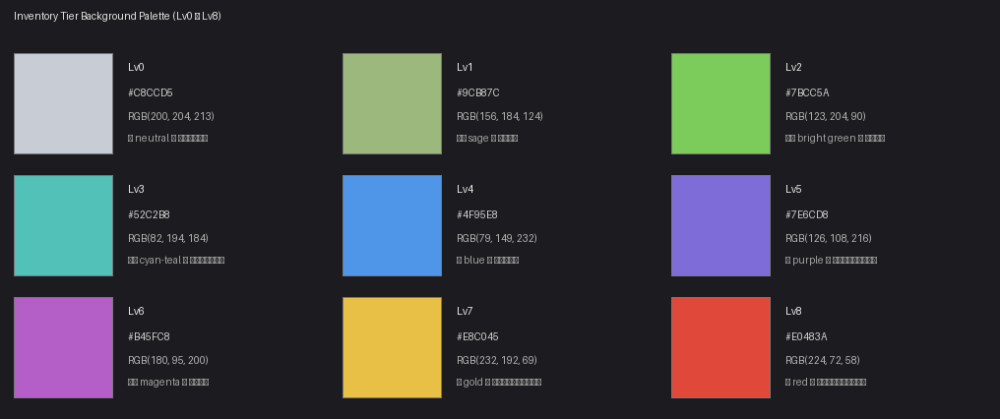

# 物品图标背景色规范

> 本文件定义 `Items/icons/` 下所有 PNG 资源**背景填充色**的统一规则。母版在 `/tmp/inventory_icons_master/`，未经允许不得修改；项目目录里输出的 PNG 必须在 256×256、RGB（A 通道保留），背景按本规范替换。

---

## 一、 九段二合等级配色（Tier Palette）

背景色由图标名后缀 `_NN`（Lv 等级）决定；缺省按 Lv0 处理。**整套色卡偏亮、偏饱和**，确保在仓库/背包列表里能一眼分出等级。

| Tier | 名称 | Hex | RGB | 用途定位 |
|:---:|---|---|---|---|
| **Lv0** | 中性灰 | `#C8CCD5` | (200, 204, 213) | 起始档、未激活、未进入二合树的原始原料 |
| **Lv1** | 沙绿 | `#9CB87C` | (156, 184, 124) | 早期可得、Lv1 装备、基础背包 |
| **Lv2** | 亮绿 | `#7BCC5A` | (123, 204, 90) | 二合树早期节点、强化原料 |
| **Lv3** | 青蓝 | `#52C2B8` | (82, 194, 184) | 中阶原料、护甲/头盔起步 |
| **Lv4** | 蓝 | `#4F95E8` | (79, 149, 232) | 通用强化件、中阶消耗品 |
| **Lv5** | 紫 | `#7E6CD8` | (126, 108, 216) | 高阶消耗品、升级件 |
| **Lv6** | 品红 | `#B45FC8` | (180, 95, 200) | 中阶护甲/头盔/背包、战术物资包 |
| **Lv7** | 金 | `#E8C045` | (232, 192, 69) | 高级装备、稀有物资包 |
| **Lv8** | 红 | `#E0483A` | (224, 72, 58) | 顶级装备、战场终极件、Boss 级物资包 |

视觉色板（hex + RGB）：

---

## 二、 配色派生规则

1. **默认派生**：图标文件名后缀 `_NN`（两位数）直接对应 tier。
   - 例：`material_textile_thread_01.png` → Lv1 → 沙绿 `#9CB87C` 背景
   - 例：`consumable_outpost_rations_08.png` → Lv8 → 红 `#E0483A` 背景

2. **贝妮（Benny）武器特例**：Benny 的三件专属 SMG 没有数字后缀，按武器定位硬编码：
   | 武器 ID | Tier | 背景色 |
   |---|---|---|
   | `weapon_benny_defender_9`（防卫者-9，tier-1 初始 SMG） | Lv1 | `#9CB87C` |
   | `weapon_benny_hare_hopper`（野兔跳跃者，tier-2 中阶 SMG） | Lv2 | `#7BCC5A` |
   | `weapon_benny_dawn_pulse`（黎明初霁，tier-3 高阶 SMG） | Lv3 | `#52C2B8` |

3. **无后缀或后缀缺失**：按 Lv0 处理（中性灰）。

4. **武器/武器配件类别**：本规则**不适用**。`weapon/` 与 `weapon_attachment/` 下的图标保持原画面的暗色背景，不参与 tier 色卡替换（武器 UI 走的是另一套装备槽展示规范）。

---

## 三、 背景替换实施规则（程序化部分）

所有项目 PNG 必须满足以下处理要求：

1. **尺寸**：256×256，模式 RGB 或 RGBA（A 通道保留为 255）。
2. **处理源**：始终从母版 `/tmp/inventory_icons_master/<category>/<icon>.png` 读取，**不得修改母版**。
3. **背景检测**：基于量化的颜色聚类（median cut）将母版压到 6–10 色，按角落采样 vs 中心采样区分 bg / body。
4. **背景填充**：检测出的 bg 像素全部替换为本 tier 对应 hex 值；body 像素保留原样。
5. **尺寸兜底**：处理后若输出不是 256×256，必须 LANCZOS resize 至 256×256 再落盘。

---

## 四、 已知处理难点

下列 icon 在母版里 bg 与 body 颜色非常接近（差距 RGB 总和 ≤ 60），自动检测会出现 tier 色斑漏到主体的情况，需逐张手动调阈值或重画母版：

| 类别 | 图标 | 问题描述 |
|---|---|---|
| backpack | `backpack_tactical_pack_08` (Lv8) | bg RGB≈(63,67,70)，body RGB≈(14,19,21)，bg 比 body 亮 |
| material | `material_riveted_plate_02` (Lv2) | bg RGB≈(10-13)，body RGB≈(40-65)，bg 比 body 暗 |
| consumable | `consumable_outpost_rations_08` (Lv8) | bg 与 body 同为深蓝绿 |
| consumable | `consumable_frontline_rescue_08` (Lv8) | bg 与 body 同为深色 |
| consumable | `consumable_squad_supply_07` (Lv7) | bg 检测把内部纹理吞掉 |
| consumable | `consumable_debridement_dressing_03` (Lv3) | bg 替换不全 |
| material | `material_reinforced_plate_03` (Lv3) | cyan tier 色漏进 body |
| material | `material_dense_fabric_pack_04` (Lv4) | body 检测分裂 |
| material | `material_crystal_purification_core_08` (Lv8) | red tier 色漏进 body |
| supply_package | `supply_food_02` (Lv2) | green tier 色漏进 body |
| supply_package | `supply_medical_04` (Lv4) | body 检测分裂 |
| helmet | `helmet_salvaged_shell_01` (Lv1) | body 检测把头盔切成两半 |
| collectible | `collectible_badge_01` (Lv1) | body 检测只识别外圈光环 |

**白边兜底特例**：`supply_armor_04` 母版背景为 JPEG 风格的纯白（不是暗灰），普通检测漏检，需对 RGB>240 + RGB>200 的像素单独用 tier 色覆盖（已实现）。

---

## 五、 当前处理状态

- 母版：`/tmp/inventory_icons_master/` — **不可修改**，角像素校验为 RGB~(28,36,38) / (76,87,93) 系列暗灰。
- 项目目录：`Items/icons/` 下 95 个 PNG，按本规范生成对应 tier 背景。
- 上一轮逐 PNG 色卡已废弃（参见对话历史），本文件为唯一规范来源。

变更本规范时请同步更新 `apply_tier_backgrounds*.py` 里的 `TIER_COLORS` 字典，并重新生成视觉色板图 `assets/tier_bg_palette.png`。
